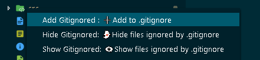

# AnGitIgnored

[⬇️Download](https://marketplace.visualstudio.com/items?itemName=AnAppWiLos.gitignoreadd)

## Description

You can :

- Add specif file in `.gitignore`
- Show/Hide the files in `.gitignore`

with this `Visual Studio Code` Extension.

## Use

Right click on the file to be added in .gitignore.

## Developers

# Run this project

    npm install
    
### Tools for developer this project

    npm install npm@latest -g
    npm install -g yo
    npm install -g generator-code
    npm install -g vsce 
    npm install -g typescript

## Commands

    vsce package
    code --install-extension my-extension-0.0.1.vsix
 <!--   
    npm install --save-dev @types/node
    npm i @types/mocha
    npm install "@types/node" --save-dev 
 -->  
<!-- https://code.visualstudio.com/api/working-with-extensions/publishing-extension -->
<!-- https://medium.com/@Ealsur/extensiones-en-visual-studio-code-39463fee452e -->

<!-- https://geeks.ms/jorge/2017/07/17/crear-nuestra-primera-extension-para-visual-studio-code-i/ -->